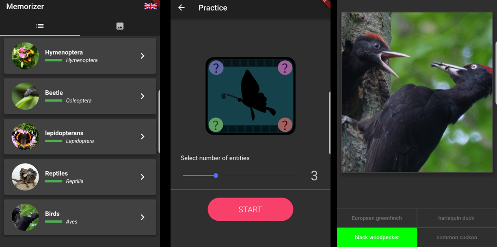
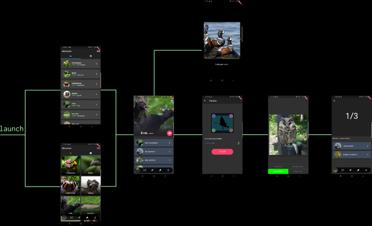
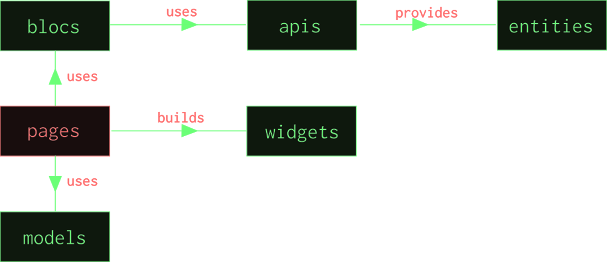

# Memorizer

This application was made mainly to demonstrate abilities of Flutter framework and its comparison to the native Android.

**Budget: ~20 hours of work.**

## Application UI

* select a category of animals
* go into the detail page and press the floating button
* select number of animals that will appear in the test and press START
* at the end of the test, the number of correct answers will show up
* supported languages: Latin, English, Czech

### Application flow

## Architecture

* tried to use Bloc pattern; only for fetching categories, though
* used `SharedPreferences` to store language settings
* all data is static (for now), stored in JSON file in the assets
* images are taken from `Flickr api`

## TODO

* more animals
* more features :-) 
* configure AWS database that will store metadata
* add/edit new images and translations using AWS and flickr API

## License

    MIT License

    Copyright (c) 2019 Adam Vesecký

    Permission is hereby granted, free of charge, to any person obtaining a copy
    of this software and associated documentation files (the "Software"), to deal
    in the Software without restriction, including without limitation the rights
    to use, copy, modify, merge, publish, distribute, sublicense, and/or sell
    copies of the Software, and to permit persons to whom the Software is
    furnished to do so, subject to the following conditions:

    The above copyright notice and this permission notice shall be included in all
    copies or substantial portions of the Software.

    THE SOFTWARE IS PROVIDED "AS IS", WITHOUT WARRANTY OF ANY KIND, EXPRESS OR
    IMPLIED, INCLUDING BUT NOT LIMITED TO THE WARRANTIES OF MERCHANTABILITY,
    FITNESS FOR A PARTICULAR PURPOSE AND NONINFRINGEMENT. IN NO EVENT SHALL THE
    AUTHORS OR COPYRIGHT HOLDERS BE LIABLE FOR ANY CLAIM, DAMAGES OR OTHER
    LIABILITY, WHETHER IN AN ACTION OF CONTRACT, TORT OR OTHERWISE, ARISING FROM,
    OUT OF OR IN CONNECTION WITH THE SOFTWARE OR THE USE OR OTHER DEALINGS IN THE
    SOFTWARE.
